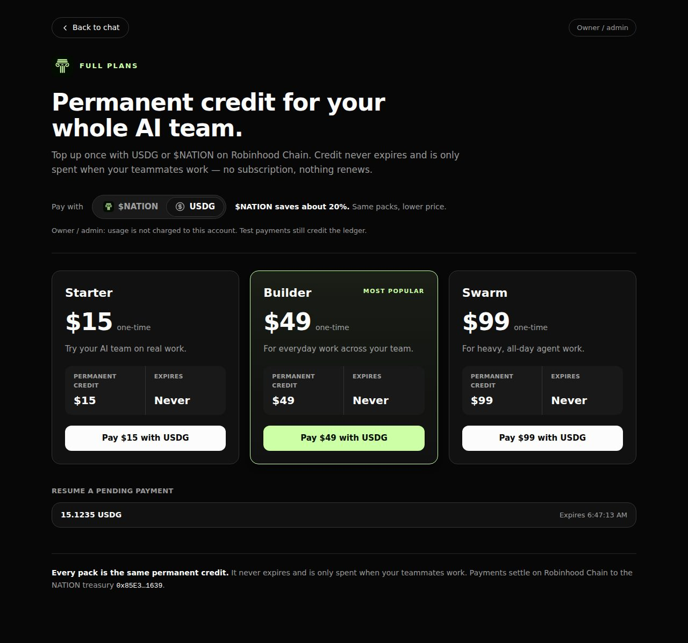
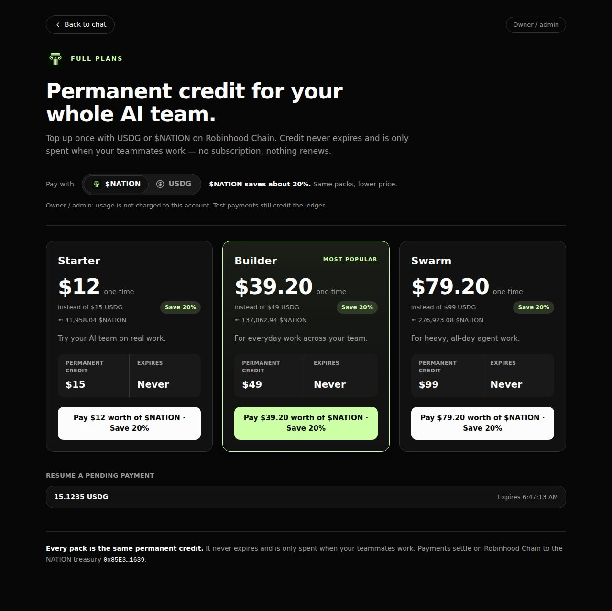
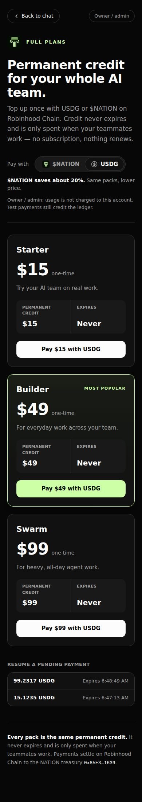
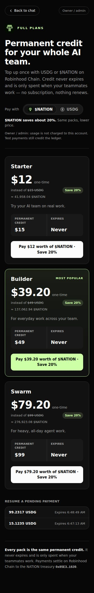
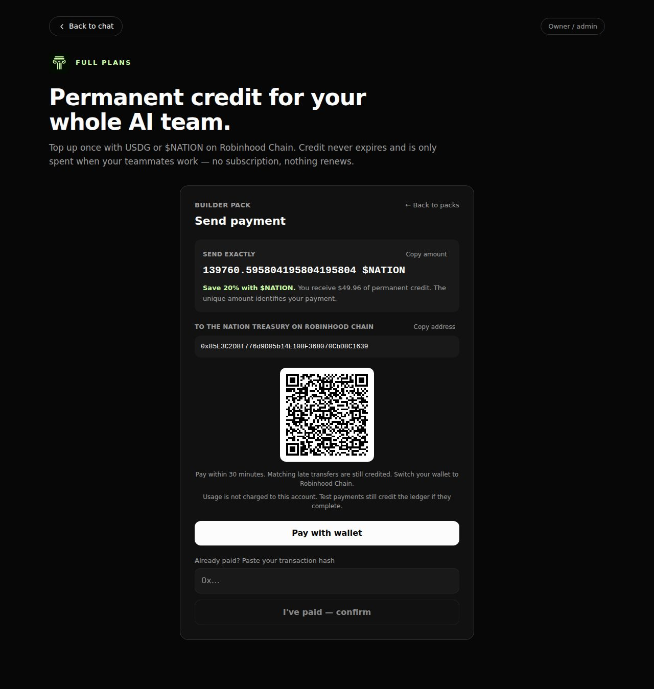
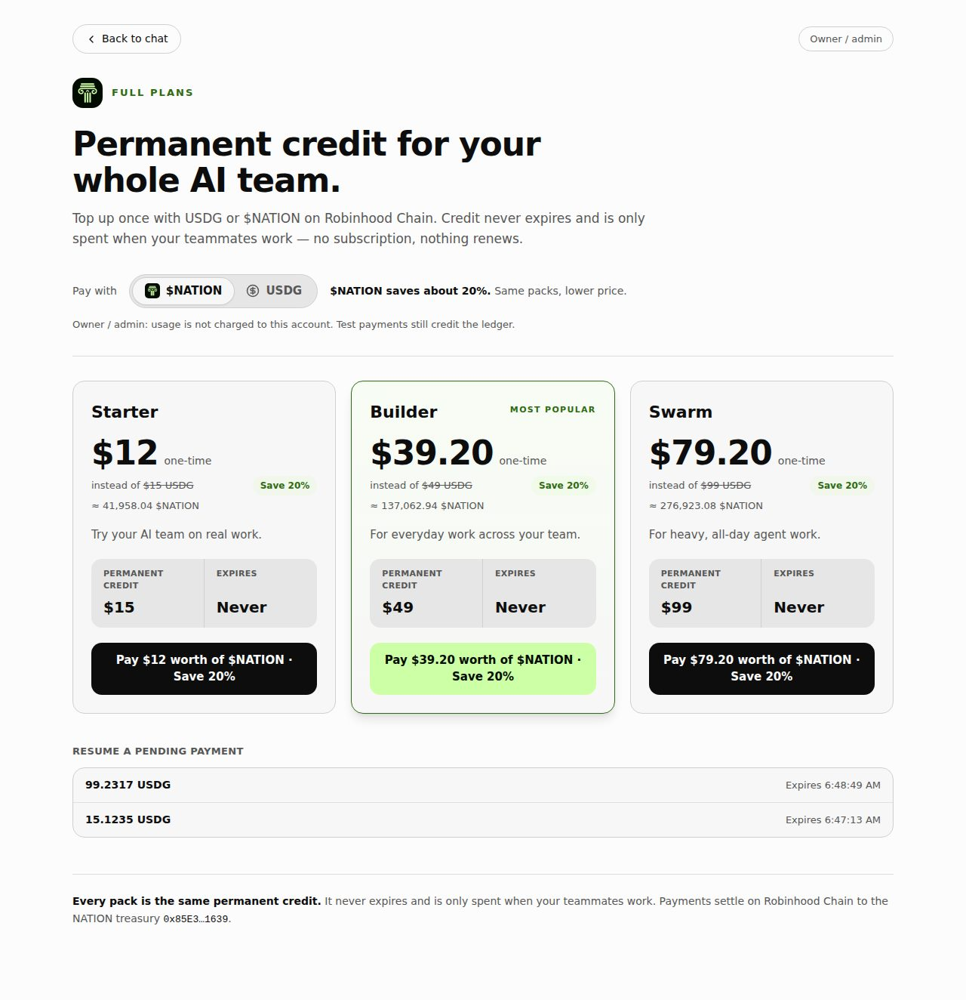

# Full Plans and the credit money path — 2026-09-26 record

A dated run of top-up against an isolated fixture: what passed, and what it does
not prove.

## Setup

- The real server (`server/index.ts`) in a temporary home and data directory with
  the fake engine, built the way `scripts/control-omb.ts launch` builds its
  fixture, plus the settings that turn top-up on:
  `NATION_TREASURY_ROBINHOOD=0x85E3C2D8f776d9D05b14E108F368070CbD8C1639`,
  `NATION_TOKEN_USD_PRICE=0.000286`, `NATION_TOKEN_DISCOUNT` unset (0.2).
- A loopback stand-in for Robinhood Chain (chain id 4663) answering the server's
  viem client: one block per second, and ERC-20 Transfer logs, receipts and
  blocks for the transfers the run adds. No real chain, wallet, token or treasury
  was touched.
- The credit database seeded with the rows seen on the live page: a $25 USDC
  invoice on Base (8453), a USDG invoice from before $NATION was priced, and a
  $NATION row carrying stablecoin units.
- The production build (`vite build`) served behind the `vercel.json` rewrites
  (`/subscription`, `/swarm/*`, `/api/*`), and the Vite dev server, both driven
  by headless Chromium.

## Checks — 30 of 30 passed

| Check | Result |
| --- | --- |
| The strip's Top up links to `/subscription` and lands on Full Plans: no sheet, no chat shell underneath | pass |
| Account menu "Top up / Billing" and Settings → Billing & Credits "Top up" go to `/subscription` | pass |
| Dev server: Top up → `/swarm/subscription` renders Full Plans | pass |
| Pending payments: the USDG row reads `15.1235 USDG`; no `?`, no `25.1462` Base row, no `0.0000` | pass |
| Pay with: USDG by default; "$NATION saves about 20%. Same packs, lower price." | pass |
| With $NATION: Builder `$39.20`, `instead of $49 USDG` struck through, `Save 20%`, `≈ 137,062.94 $NATION`, CTA `Pay $39.20 worth of $NATION · Save 20%` | pass |
| $NATION invoice POST `{chain: 4663, token: 0xc839…, packUsd: 49}`; the invoice pays `0x85E3C2D8f776d9D05b14E108F368070CbD8C1639` with `discount_bps` 2000 and a `token_amount` equal to the server formula at exactly 80% of the full price | pass |
| Checkout shows that treasury and `Send exactly 139760.595804195804195804 $NATION`, at full precision | pass |
| A $NATION transfer of that amount, confirmed by pasting its hash, credits the full pack (`$49.964413`) | pass |
| USDG invoice POST carries the USDG token; the invoice pays the same treasury at the pack price (`15.766122 USDG`) | pass |
| The payment scan credits that USDG transfer with no hash pasted, in 23 s, while $NATION is listed first on the same chain id | pass |
| A token-less invoice request (an older client) is billed in USDG | pass |
| 390 px wide: no horizontal overflow with either token | pass |

## Screenshots

| USDG | $NATION |
| --- | --- |
|  |  |
|  |  |

## What this does not prove

- No real Robinhood Chain RPC, wallet, token contract or treasury was used; this
  environment cannot reach them. The token decimals (18 for $NATION, 6 for USDG)
  come from the founder's instructions and the code, not from the chain.
- The run signs in as the owner (exempt) account. Member accounts use the same
  page and routes but were not driven here.
- The harness was a session-local script, not a `control-omb` command.
