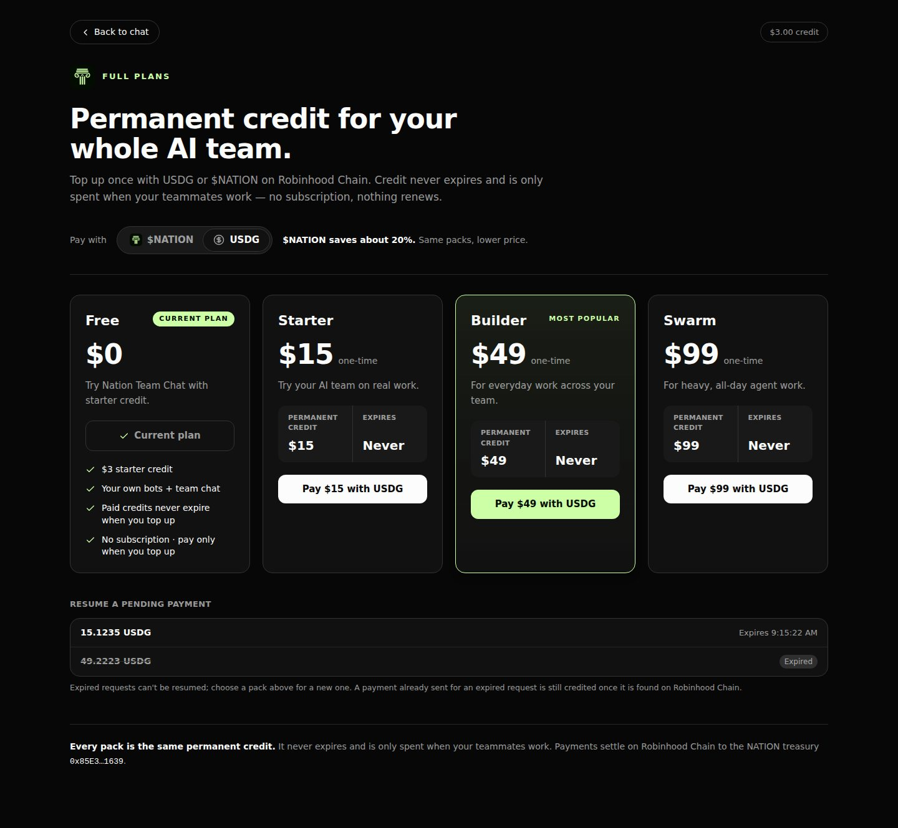
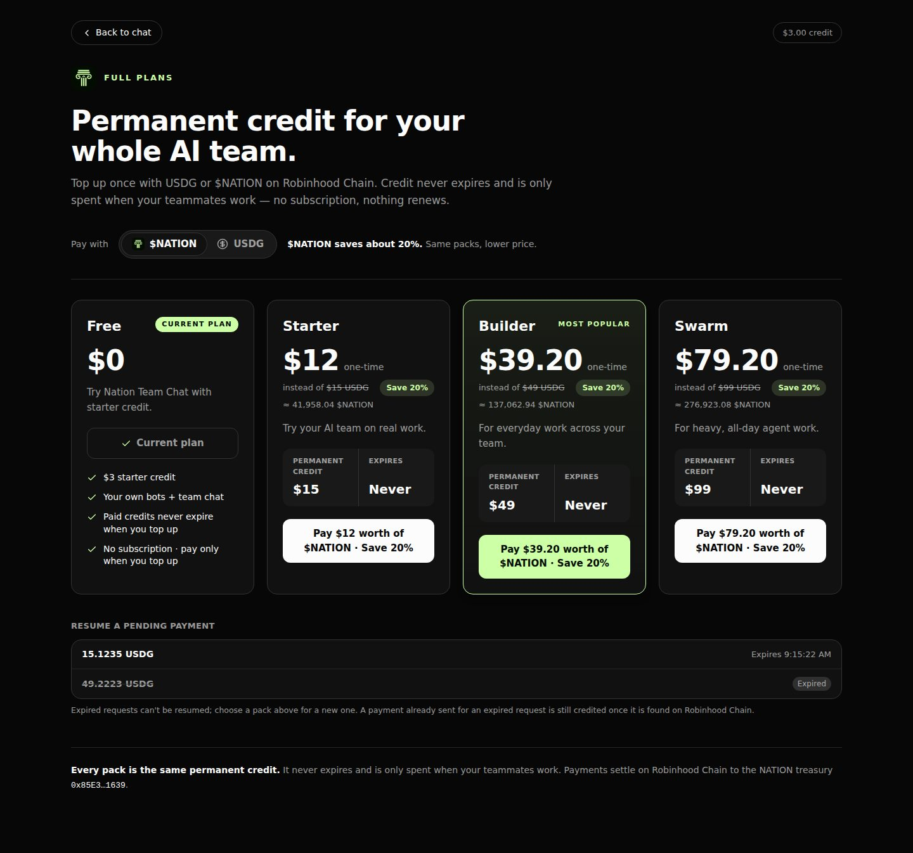
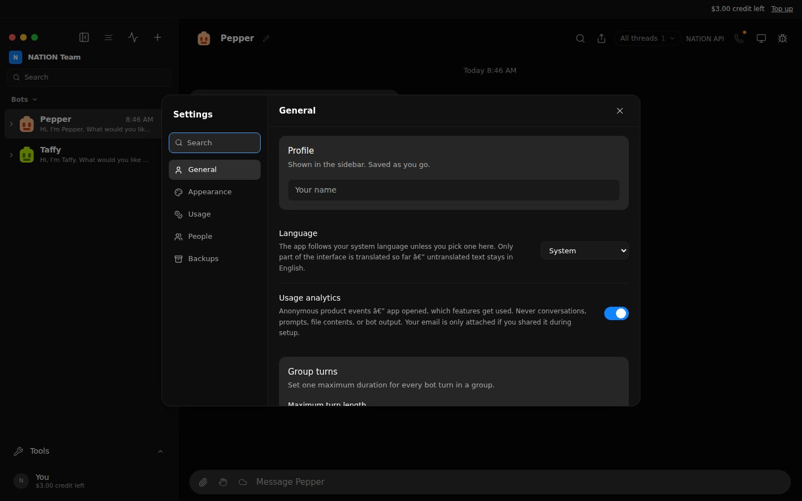
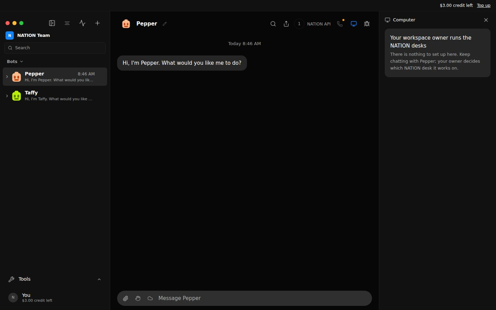
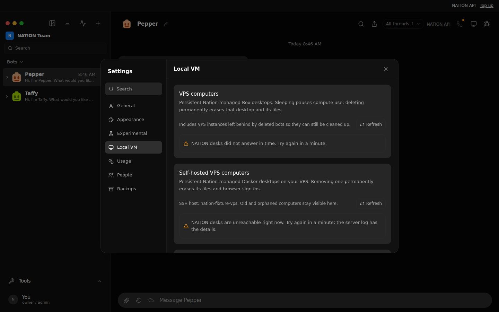
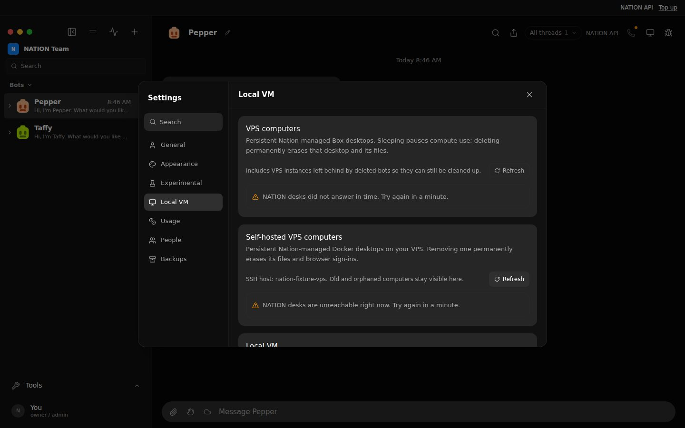
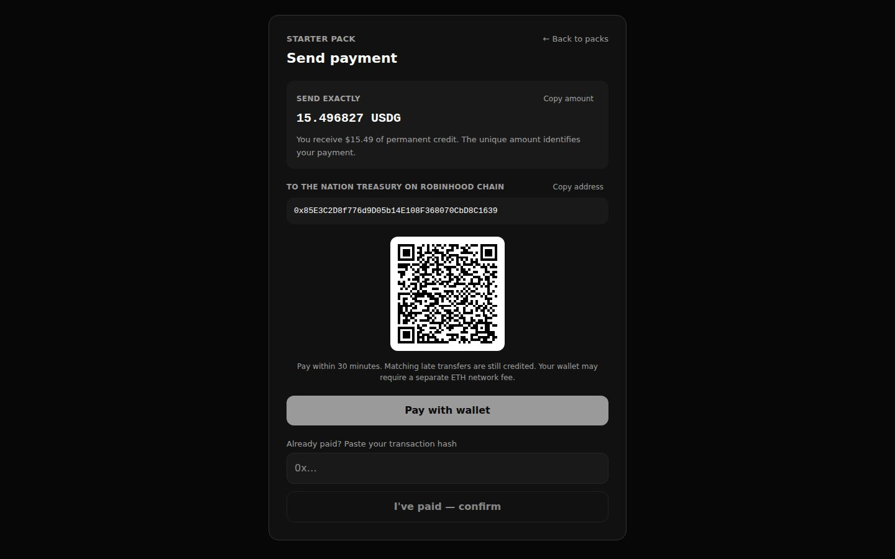
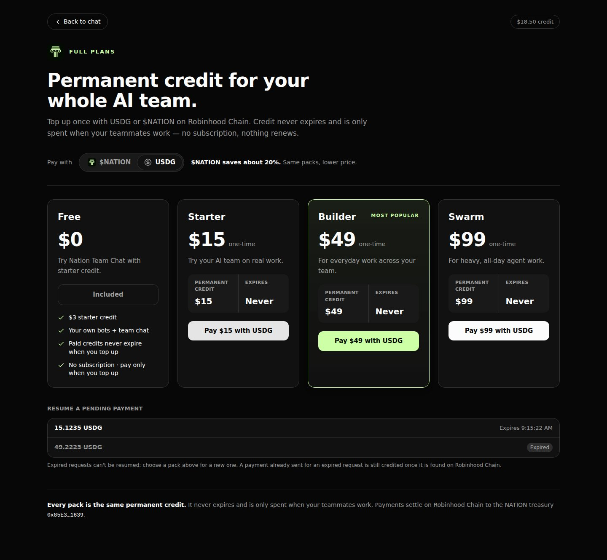
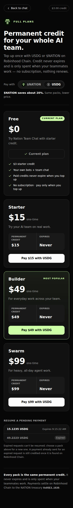

# Launch blockers and the Free plan — 2026-09-26 record

A dated fixture run of four launch blockers: the desk inventories behind
Settings → Local VM, what a member sees of desks, pending payment requests, and
the Free column on Full Plans. The last section is the smoke a person runs after
the deploy; nothing here proves that live Robinhood Chain credit works.

## Setup

- The real server (`server/index.ts`) in a temporary home and data directory with
  the fake engine and the hermetic environment `scripts/control-omb.ts` builds
  (`PATH` holds only Node, so Docker and SSH are absent), plus:
  - top-up live: `NATION_TREASURY_ROBINHOOD=0x85E3C2D8f776d9D05b14E108F368070CbD8C1639`,
    `NATION_TOKEN_USD_PRICE=0.000286`, and a loopback stand-in for Robinhood
    Chain (4663) serving real Transfer logs, receipts and blocks;
  - hosted email sign-in (`OMB_PUBLIC_URL`, the repository's control-plane stub for
    the emailed code) and one member, `cos@example.test`, signed in through the
    public host the way a browser is: a `client`-scope cookie session;
  - desk providers that are down: a Box token whose API stand-in
    (`OMB_BOX_API`) accepts connections and never answers, and a VPS SSH alias
    whose Docker and SSH tools are missing.
- The member's credit database seeded with a live USDG request, one that expired
  15 minutes earlier, one that expired two days earlier, and a Base (8453) row
  from before the Robinhood-only migration.
- The production build (`vite build`) behind the `vercel.json` rewrites, with a
  switch that makes the "gateway" answer a bare HTML 502 for one API path, as the
  web host or a reverse proxy does when it gives up on the server. Driven by
  headless Chromium as the loopback owner and as the member.

## Why Settings said "VPS inventory request failed (502)"

That text is the client's fallback for a response whose body carries no JSON
`error`. The server's own errors always carry one, so the 502 came from a proxy
in front of it, not from the app. The two reads behind the cards are slow by
design when a provider is unhealthy: Docker over SSH allows 20 s per command (a
listing is two commands) and the cloud listing 20 s per page. A proxy stopped
waiting and answered 502 itself. The reads now answer 200 within 8 s with an
empty list and a NATION-owned reason; the real cause goes to the server log, for
example `computer inventory (boxes) unavailable: no answer within 8 s`.

## Checks — 30 of 30 passed

| Check | Result |
| --- | --- |
| Owner: the cloud desk inventory answers 200 in 8.2 s while its provider never replies | pass |
| Owner: the self-hosted desk inventory answers 200 while Docker/SSH are unavailable | pass |
| Owner: both cards show a NATION-owned reason; no "request failed", no code, no provider or Docker wording | pass |
| Owner: the in-house desk sections are still there for the owner | pass |
| Owner, cold start: Settings lists Local VM | pass |
| Owner: after renaming the profile (a config save and its event), Local VM is still listed | pass |
| …and so is Experimental | pass |
| Gateway: the emulated proxy answered a bare 502 | pass |
| That 502 renders as "NATION desks are unreachable right now. Try again in a minute." | pass |
| Owner Full Plans: Free without a Current plan badge; its button reads "Owner access" (exempt) | pass |
| Member Full Plans: four columns, Free, Starter, Builder, Swarm | pass |
| Free: CURRENT PLAN badge, `$0`, "Try Nation Team Chat with starter credit." | pass |
| Free: "$3 starter credit" from the ledger grant, and the rest of the checklist | pass |
| Free: its button is "✓ Current plan" and disabled | pass |
| The badge is NATION lime `#CDFFA6` on dark ink, upper case | pass |
| 1440 px: the four cards sit in one row | pass |
| USDG is the default: "Starter: Pay $15 with USDG", no Save badge | pass |
| Pending: the live USDG row and the recently expired row; no Base `25.1462`, no `?`, no two-day-old row | pass |
| Pending: only the live row is a button; the expired row is inert and labelled Expired | pass |
| $NATION: packs show the 20% saving; the Free card is unchanged by the toggle | pass |
| 390 px: no horizontal overflow | pass |
| Member Settings: no Local VM section and no Box / SSH / "not configured" copy | pass |
| Member Settings search for "vm" finds no Local VM section | pass |
| Member Computer panel: a NATION explanation, no desk setup, nothing "Unavailable here" | pass |
| The member's browser made its API calls through the gateway | pass |
| The member never requested a desk inventory or computer route | pass |
| The member's Starter USDG invoice pays the founder treasury on Robinhood Chain | pass |
| The payment scan credited the USDG transfer with no hash pasted, 32 s after it landed (one 30 s scan interval) | pass |
| Status after paying: `plan: "paid"`, `onFreePlan: false` | pass |
| Full Plans after paying: Free reads "Included", no badge, and is still not for sale | pass |

Found on the way, and fixed here: twice, on a freshly started fixture, the
owner's Settings showed no Local VM (nor Experimental). Admin event streams sent
`config` without the server's owner verdict, so any config event (the engine
registry sends one after boot, and every save sends one) left the owner's client
without it, and admin-only sections disappeared until the next reload. Admin
config events and the admin-only config save response now carry
`isProductOwner: true`, and the client keeps its verdict when a config arrives
without one. The final run above started cold and passed first time.

Harness notes: one driver attempt stopped on its own unawaited
`waitForResponse`; the driver now handles it. An earlier run counted a manual
`curl` probe made with the member cookie as a member desk request; the check now
counts only requests made after the member's browser session starts.

## Screenshots

| Paying with USDG | Paying with $NATION |
| --- | --- |
|  |  |

| Member Settings | Member Computer panel |
| --- | --- |
|  |  |

| Owner: providers down | Owner: gateway 502 |
| --- | --- |
|  |  |

## Unit and contract tests

- `server/routes/computer-inventory.test.ts`: a provider that never replies, one
  that throws, one that reports Docker/SSH or cloud wording, a rejected key,
  healthy and unconfigured pass-through, one listing shared by concurrent reads,
  log de-duplication, no unhandled late rejection, and no SSH alias in a
  response that is not the owner's.
- `server/index.test.ts`: a config save and its event both carry the owner
  verdict to an admin; `src/state/store.test.ts`: a config without a verdict
  keeps the one the session has, and an explicit one always wins.
- `src/components/nation-member-computers.test.ts`: Local VM is admin-only even
  with a forged local unlock; a member's Settings never renders it, not even
  when it was the requested section; the member Computer panel; the owner still
  gets the section.
- `src/components/LocalComputerSection.test.ts`: a bare 502/504, a server 5xx and
  a dropped connection read as "unreachable"; an abort is still honoured.
- `server/nation-credits.test.ts`: an RPC failure on $NATION is logged with its
  chain and token (without the RPC URL or its key) while USDG is still scanned
  and credited; a chain id other than 4663 is refused loudly for every token;
  expired requests neither pull the scan back nor cost an RPC call; a cursor
  far behind jumps to the earliest fresh request and closes the gap in one pass;
  a transfer that predates its request is set aside instead of pinning the
  cursor; a second transfer for a paid request is never credited twice and is
  logged for a refund, while one credited from a pasted hash stays quiet; the
  plan is read from the ledger.
- `src/components/NationCredits.test.ts`: the Free card in each state, the
  four-column grid, and pending rows (no Base even from a server that lists
  Base, no symbol-less row, inert expired rows, dropped after a day).

## What this does not prove

- No real Robinhood Chain RPC, wallet, token or treasury was used; this
  environment cannot reach them. Live credit is proven only by the smoke below.
- The production desks were not contacted. The run shows the inventories answer
  within the deadline whatever the provider does; it cannot show why the
  production provider was slow or down. After the deploy, the server log names it.
- The web host's own timeout for rewrites to the API was not measured.
- The harness was a session-local script, not a `control-omb` command.

## Smoke after the deploy (Cos, $15 USDG)

Run this once the web build and the API server both carry this change; they
deploy separately. Use an account that has never paid and is not owner/admin
(owner/admin accounts are exempt and show "Owner access").

1. Hard-refresh `https://thenation.city/subscription` and sign in (pair) as that
   member.
2. Full Plans shows four columns: **Free** with a CURRENT PLAN badge, `$0`, a
   disabled "✓ Current plan" button and "$3 starter credit" (the configured
   `NATION_FREE_CREDIT_USD`), then Starter, Builder and Swarm. Screenshot it.
3. Leave Pay with on **USDG**. Tap **Starter · Pay $15 with USDG**. Check the
   destination is `0x85E3C2D8f776d9D05b14E108F368070CbD8C1639` on Robinhood Chain
   and note the "Send exactly" amount (15 USDG plus a unique suffix under $1,
   which is credited too).
4. From a wallet, send exactly that USDG amount on Robinhood Chain (4663). Do
   not paste the hash yet: this run is about the automatic scan.
5. Within about two minutes the balance chip rises by the amount sent, the
   request leaves "Resume a pending payment", and the Free card reads
   "Included" with no badge. If nothing lands within five minutes, paste the
   transaction hash under "Already paid?" and note that the scan missed it.
6. On the API server, search the log for `NATION payment scan failed` and
   `computer inventory`. Record any line; each names the token or desk and the
   reason.
7. Record the transaction hash, the amount, the minutes from send to credit and
   the screenshots, and add them to this file.
